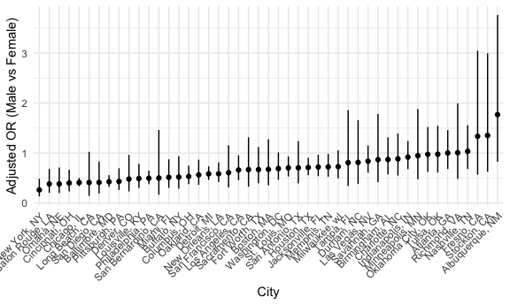
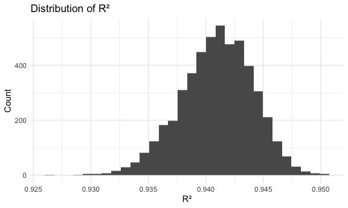
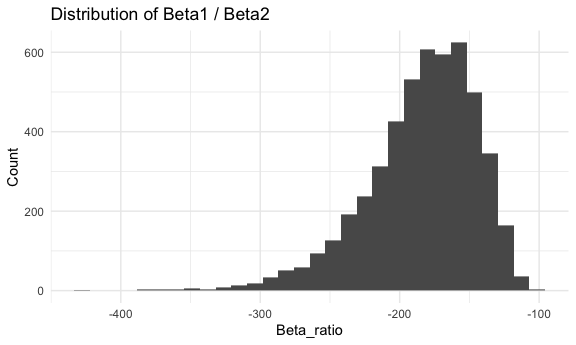

p8105_hw6_xy2672
================
2025-12-02

Load Key packages

``` r
library(tidyverse)
library(p8105.datasets)
```

## Problem 1

import dataset and clean it

``` r
homicide_df = read_csv("data/homicide-data.csv") |> 
  mutate(
    city_state = str_c(city, ", ", state),
    resolved = as.numeric(disposition == "Closed by arrest"),
    victim_age = as.numeric(victim_age)
  ) |> 
  filter(
    !city_state %in% c("Dallas, TX", "Phoenix, AZ", "Kansas City, MO", "Tulsa, AL"),
    victim_race %in% c("White", "Black"),
    !is.na(victim_age)
  )
```

    ## Rows: 52179 Columns: 12
    ## ── Column specification ────────────────────────────────────────────────────────
    ## Delimiter: ","
    ## chr (9): uid, victim_last, victim_first, victim_race, victim_age, victim_sex...
    ## dbl (3): reported_date, lat, lon
    ## 
    ## ℹ Use `spec()` to retrieve the full column specification for this data.
    ## ℹ Specify the column types or set `show_col_types = FALSE` to quiet this message.

    ## Warning: There was 1 warning in `mutate()`.
    ## ℹ In argument: `victim_age = as.numeric(victim_age)`.
    ## Caused by warning:
    ## ! NAs introduced by coercion

Create a baltimore df

``` r
baltimore_df = 
  homicide_df |> 
  filter(city_state == "Baltimore, MD")

baltimore_glm_fit = 
  baltimore_df |> 
  glm(resolved ~ victim_age + victim_sex + victim_race, data = _, family = binomial())

baltimore_results =
  baltimore_glm_fit |> 
  broom::tidy(conf.int = TRUE) |> 
  mutate(
    OR = exp(estimate),
    CI_low = exp(conf.low),
    CI_high = exp(conf.high)
  ) |> 
  filter(term == "victim_sexMale") |> 
  select(term, OR, CI_high, CI_low)
```

Run glm for each city

``` r
city_OR_df =
  homicide_df |>
  nest(data = -city_state) |>
  mutate(
    glm_fit = map(
      data,
      ~ glm(
          resolved ~ victim_age + victim_sex + victim_race,
          data = .x,
          family = binomial()
        )
    ),
    results = map(
      glm_fit,
      ~ broom::tidy(.x, conf.int = TRUE) |>
        mutate(
          OR = exp(estimate),
          CI_low = exp(conf.low),
          CI_high = exp(conf.high)
        ) |>
        filter(term == "victim_sexMale") |>
        select(term, OR, CI_low, CI_high)
    )
  ) |>
  select(city_state, results) |>
  unnest(results)
```

    ## Warning: There were 43 warnings in `mutate()`.
    ## The first warning was:
    ## ℹ In argument: `results = map(...)`.
    ## Caused by warning:
    ## ! glm.fit: fitted probabilities numerically 0 or 1 occurred
    ## ℹ Run `dplyr::last_dplyr_warnings()` to see the 42 remaining warnings.

Create plot

``` r
city_OR_df |>
  mutate(city_state = fct_reorder(city_state, OR)) |>
  ggplot(aes(x = city_state, y = OR)) +
  geom_point() +
  geom_errorbar(aes(ymin = CI_low, ymax = CI_high), width = 0) +
  labs(
    x = "City",
    y = "Adjusted OR (Male vs Female)"
  ) +
  theme(axis.text.x = element_text(angle = 45, hjust = 1))
```



From the plot, `city_state` like New York, NY; Baton Rough, LA; and
Omaha, NE; have OR less than 1, suggesting that male victims are less
likely to be solved than female victims. In contrast, `city_state` like
Albuquerque, NM; Stockton, CA; and Fresno, CA; have OR greater than 1,
suggesting that male victims are more likely to be solved than female
victims. Overall speaking, solve rates vary substantially depending on
local conditions, and since there are many estimates have wide CIs that
include 1, it is hard to conclude that whether sex affects solve rates
in many `city_state`.

## Problem 2

load weather dataset

``` r
library(p8105.datasets)
data("weather_df")

set.seed(1)
```

Create a bootstrap function for one sample

``` r
boot_sample = function(df) {
  sample_frac(df, replace = TRUE)
}
```

5000 boot_strap samples

``` r
boot_straps =
  tibble(strap_number = 1:5000) |>
  mutate(
    strap_sample = map(strap_number, \(i) boot_sample(weather_df))
  )
```

Get the r2 and beta_ratio

``` r
boot_results =
  boot_straps |>
  mutate(
    models = map(strap_sample, \(df) lm(tmax ~ tmin + prcp, data = df)),
    glanced = map(models, broom::glance),
    tidied  = map(models, broom::tidy)
  ) |> 
  mutate(
  r2 = map_dbl(glanced, \(x) x$r.squared),
  beta1 = map_dbl(tidied, \(df) df |> filter(term == "tmin") |> pull(estimate)),
  beta2 = map_dbl(tidied, \(df) df |> filter(term == "prcp") |> pull(estimate)),
  beta_ratio = beta1 / beta2
  )|>
  select(r2, beta_ratio)
```

Plot the distribution of R squared

``` r
boot_results |>
  ggplot(aes(x = r2)) +
  geom_histogram() +
  labs(
    title = "Distribution of R²",
    x = "R²",
    y = "Count"
  )
```

    ## `stat_bin()` using `bins = 30`. Pick better value with `binwidth`.



The bootstrap distribution of R² is approximately symmetric and
bell-shaped, centered around 0.9425, with most values falling between
approximately 0.935 and 0.945. This indicates that the regression model
using tmin and prcp as predictors explains a very large proportion of
the variability in tmax consistently.

Plot the distribution of beta1 / beta2

``` r
boot_results |>
  ggplot(aes(x = beta_ratio)) +
  geom_histogram() +
  labs(
    title = "Distribution of Beta1 / Beta2",
    x = "Beta_ratio",
    y = "Count"
  ) 
```

    ## `stat_bin()` using `bins = 30`. Pick better value with `binwidth`.



The bootstrap distribution of the ratio beta1 / beta2 is strongly
right-skewed and entirely negative, with most values falling between
approximately –250 and –150.

Get the 95% CI from estimates:

``` r
boot_ci =
  boot_results |>
  summarize(
    r2_low   = quantile(r2, 0.025),
    r2_high  = quantile(r2, 0.975),
    br_low   = quantile(beta_ratio, 0.025),
    br_high  = quantile(beta_ratio, 0.975)
  ) |> 
  knitr::kable()

boot_ci
```

|    r2_low |   r2_high |    br_low |   br_high |
|----------:|----------:|----------:|----------:|
| 0.9343767 | 0.9466277 | -279.7489 | -125.6859 |

## Problem 3
